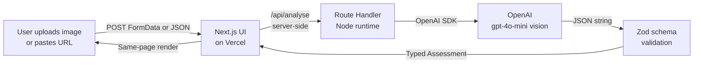

# AI Vehicle Claims Prototype

Preliminary AI-assisted vehicle damage assessment for insurance intake — a customer-ready full-stack prototype built for a Solutions Engineer take-home exercise.

- 🌐 **Live demo:** https://ai-vehicle-claims-prototype-p6sy.vercel.app
- 💻 **Source:** https://github.com/atulkaila/ai-vehicle-claims-prototype
- 📄 **Statement of Work:** [docs/SOW.md](docs/SOW.md)

An insurance assessor uploads a photo of a damaged vehicle (or pastes a public image URL). The app returns vehicle metadata (make / model / colour), a textual damage summary, a preliminary GBP cost range, per-section confidence indicators, and a human-review flag — all on the same page.

Results are **decision support**, not automated claim approval.

---

## Table of contents

- [Quick demo](#quick-demo)
- [Architecture](#architecture)
- [Setup — run locally](#setup--run-locally)
- [Deployment](#deployment)
- [How the AI logic works](#how-the-ai-logic-works)
- [Design decisions](#design-decisions)
- [Security & privacy](#security--privacy)
- [Multi-layer error handling](#multi-layer-error-handling)
- [Limitations](#limitations)
- [Future improvements](#future-improvements)
- [Tech stack](#tech-stack)
- [Scripts reference](#scripts-reference)

---

## Quick demo

Open the [live demo](https://ai-vehicle-claims-prototype-p6sy.vercel.app), then:

1. Click **Choose File** and select any damaged-car photo (JPEG / PNG / WebP, up to 4 MB)
2. Click **Analyse damage**
3. Results appear on the same page in ~3–8 seconds

Sample output for a photo of a crashed BMW 1 Series:

| Section | Value | Model confidence |
| --- | --- | --- |
| **Vehicle** | BMW, 1 Series, grey | 80% |
| **Damage** | *"Significant front-end collision damage with deformations to the bonnet, front bumper, and grille."* — severity: **Severe** | 90% |
| **Repair estimate** | **£2,000 – £4,000** (GBP) | 75% |
| **Human review** | **Required** | — |

An intentional anti-fraud demo: uploading a photo that isn't a vehicle (e.g. a dog) returns `"Unknown"` for every field with 0% confidence and a mandatory human-review flag — the model refuses to hallucinate an insurance claim.

---

## Architecture



The browser only ever calls the same-origin `/api/analyse` endpoint. All OpenAI credentials stay server-side in Vercel's encrypted environment variables. `Zod` is the single source of truth for the response contract — TypeScript types in `lib/types.ts` are inferred from the same schema used at runtime.

More detailed diagrams are in [docs/architecture_mvp.svg](docs/architecture_mvp.svg) and [docs/architecture_3_phase.svg](docs/architecture_3_phase.svg).

---

## Setup — run locally

### Prerequisites

- **Node.js 20+** and npm
- An **OpenAI API key** with paid credit ([platform.openai.com/api-keys](https://platform.openai.com/api-keys))

### Steps

```bash
git clone https://github.com/atulkaila/ai-vehicle-claims-prototype.git
cd ai-vehicle-claims-prototype/apps/vehicle-claims-ui

npm install

# Create the local env file from the template
cp .env.example .env.local
# Edit .env.local and paste your OpenAI key into OPENAI_API_KEY

# Smoke-test the OpenAI connection before running the app (optional but useful):
node scripts/smoke.mjs
# Expected: "SMOKE TEST PASSED" with a Ford Mustang identification

# Run the dev server
npm run dev
```

Open [http://localhost:3000](http://localhost:3000).

### Environment variables

| Variable | Required | Purpose |
| --- | --- | --- |
| `OPENAI_API_KEY` | Yes | Server-side OpenAI credential. Never prefix with `NEXT_PUBLIC_`. |
| `OPENAI_MODEL` | No (default `gpt-4o-mini`) | Vision-capable OpenAI chat model. |

`.env.local` is git-ignored. Only `.env.example` (with placeholders) is committed.

---

## Deployment

The live demo is deployed on **Vercel** with Framework Preset `Next.js` and Root Directory `apps/vehicle-claims-ui`. Environment variables are stored in Vercel's encrypted secret store and injected at runtime. Every push to `main` on GitHub triggers an automatic deployment.

To fork and deploy your own:

1. Fork the repo on GitHub
2. In Vercel → **New Project** → import your fork
3. **Configure Project:**
   - Framework Preset: `Next.js`
   - Root Directory: `apps/vehicle-claims-ui` (⚠ must override the default)
   - Add `OPENAI_API_KEY` and (optionally) `OPENAI_MODEL` as environment variables — masked, never revealed
4. Click **Deploy**

The first build takes ~90 seconds. Subsequent pushes deploy automatically.

---

## How the AI logic works

The `/api/analyse` route ([apps/vehicle-claims-ui/app/api/analyse/route.ts](apps/vehicle-claims-ui/app/api/analyse/route.ts)) does the following:

1. **Accepts input** — either a `multipart/form-data` file upload (JPEG / PNG / WebP, ≤4 MB) or JSON `{ imageUrl }`
2. **Sanity-checks the input** — content type, size, URL protocol, and rejects private-IP / localhost URLs (basic SSRF guard)
3. **Prepares the image** — file uploads are converted to a base64 `data:` URL so OpenAI receives the bytes directly; public URLs are passed through
4. **Calls OpenAI** — `chat.completions.create` on `gpt-4o-mini` with:
   - A strict **system prompt** ([full prompt](apps/vehicle-claims-ui/app/api/analyse/route.ts)) that defines the exact JSON schema, the confidence semantics, review-required rules, and instructs the model to bail out with `"Unknown"` values when the image is not a vehicle or is unclear
   - `response_format: { type: 'json_object' }` to enforce JSON output
   - A 45-second timeout
5. **Parses & validates** — the raw string is `JSON.parse`d, then validated against a `Zod` schema ([lib/assessmentSchema.ts](apps/vehicle-claims-ui/lib/assessmentSchema.ts)) which enforces:
   - Non-empty strings for make / model / colour / summary
   - `severity` ∈ `{minor, moderate, severe, unknown}`
   - Cost `min ≥ 0`, `max ≥ min`, 3-letter currency
   - All three confidences between 0 and 1
6. **Returns** the typed `Assessment` JSON on success — or a customer-safe error envelope on failure. **Never a mock. Never a hallucinated success.**

TypeScript types in [lib/types.ts](apps/vehicle-claims-ui/lib/types.ts) are inferred from the Zod schema, so runtime and compile-time contracts cannot drift.

---

## Design decisions

| Choice | Rationale |
| --- | --- |
| **Next.js 15 App Router + a single monorepo** | One app for both UI and API; server-side route handler keeps the OpenAI key off the client. Simpler than a separate backend. |
| **Vercel Hobby tier** | Zero-config Next.js hosting, free, encrypted env vars, auto-deploy on push, native serverless functions with the 60 s max duration we need. |
| **OpenAI `gpt-4o-mini` vision** | Cheap (~£0.0002 per assessment), fast (~2–5 s), supports images + JSON output. Adequate accuracy for a prototype. |
| **Zod as the single source of truth** | Runtime validation the model output has the expected shape *and* automatic TypeScript type inference. Prevents drift between what the code assumes and what actually arrives. |
| **`json_object` output mode + prompt-based schema** | Simpler than JSON Schema structured outputs, works reliably with the current model, keeps the schema readable inside the system prompt. |
| **Single-request assessment (no multi-agent orchestration)** | Prototype focus is validating the customer experience. One prompt for vehicle ID + damage + cost keeps latency and cost minimal. Production could split into specialised agents. |
| **Preliminary GBP cost range (not a point estimate)** | Image-only cost prediction has intrinsic uncertainty. A range communicates that better than a single number. |
| **Independent confidences for vehicle / damage / cost** | A single global confidence would hide the fact that we may be certain about the make but very uncertain about cost. Three separate values match the three separate reasoning steps. |
| **Human-review flag surfaced prominently in the UI** | The app is decision support, not decision-making. Users always see whether the AI thinks a case needs a human. |

---

## Security & privacy

- **API keys are server-side only.** Never prefixed with `NEXT_PUBLIC_`, never sent to the browser, never logged in error responses.
- **No image persistence.** Uploads are streamed to OpenAI and dropped. Nothing is written to disk, blob storage, or a database.
- **No user data.** No accounts, no cookies for tracking, no analytics.
- **Layered input validation:** URL syntax → browser preview → server MIME/size checks → SSRF guard for URL input → OpenAI content moderation → Zod response validation.
- **Customer-safe error envelopes.** The API never returns raw OpenAI error messages, stack traces, or provider identifiers to the browser.

---

## Multi-layer error handling

The API returns a consistent error envelope with a specific `code`:

```json
{
  "error": {
    "code": "IMAGE_TOO_LARGE",
    "message": "Image exceeds the 4 MB limit."
  }
}
```

| Code | HTTP | When |
| --- | --- | --- |
| `INVALID_INPUT` | 400 | Missing / conflicting inputs; malformed body |
| `INVALID_IMAGE` | 400 | Unsupported file type |
| `IMAGE_TOO_LARGE` | 413 | Upload > 4 MB |
| `INVALID_URL` | 400 | Not http/https, or private / loopback host |
| `IMAGE_FETCH_FAILED` | 400 | OpenAI could not download the image |
| `MODEL_ERROR` | 502 | Upstream OpenAI outage or 5xx |
| `INVALID_MODEL_RESPONSE` | 502 | Model returned non-JSON or Zod parse failed |
| `INTERNAL_ERROR` | 500 | Missing configuration or unhandled error |

The UI translates each `code` into a plain-English red banner for the user — a stack trace, a mock result, or a crash is never surfaced.

---

## Limitations

This is a 3–4 hour prototype. Known limitations:

- **Confidence values are self-reported by the model, not calibrated** against real assessment outcomes.
- **Cost estimates are preliminary GBP ranges only** — based on standard UK labour rates, no hidden structural damage, no OEM vs aftermarket parts choice.
- **No authentication.** The public URL is open by design for demo purposes. In production you would gate access via SSO / Entra ID.
- **No rate limiting** on the free Vercel Hobby tier. Public exposure combined with the OpenAI budget cap on the account is the only cost protection.
- **Anti-fraud is prompt-based only** — no dedicated content moderation or forensic image analysis.
- **No persistence** — you can't view past assessments.
- **4 MB upload cap** to stay under Vercel's request-body limit. Larger images should be resized client-side before upload.
- **Wikipedia thumbnail URLs fail** because OpenAI's image fetcher can't set a Wikimedia-approved User-Agent. The app degrades gracefully to `IMAGE_FETCH_FAILED`.

---

## Future improvements

If given more time, I would prioritise (in order):

1. **Persistence and history** — store each assessment in a database (Postgres via Vercel Postgres, or Cosmos DB) so assessors can review, compare, and audit past claims.
2. **Authentication** — Microsoft Entra ID / SSO so only authorised assessors can use the app.
3. **Rate limiting and abuse controls** — a KV store (Vercel KV / Upstash Redis) with per-user and per-IP quotas; content moderation via OpenAI's moderation endpoint or Azure AI Content Safety.
4. **Move to Azure** — host on Azure App Service or Container Apps and swap OpenAI for Azure OpenAI, with managed identity replacing the API key. Add private networking, Application Insights, and Azure Monitor.
5. **Evaluation dataset & continuous quality** — a labelled gold set of vehicle photos with known outcomes, a metrics dashboard, automated regression checks on prompt or model changes.
6. **Calibrated confidence** — map self-reported confidences to observed accuracy so that "80% confidence" actually means "80% correct on the eval set".
7. **Better repair estimates** — integrate a repair-parts catalogue and labour-rate database; move away from GPT-hallucinated pricing.
8. **Multi-modal fusion** — combine the damage photo with a VIN plate photo, telematics data, and prior claim history for a richer assessment.
9. **Human review workflow** — a queue for flagged claims, comment threads, assessor assignments, disagreement handling, SLA tracking.
10. **Client-side image compression** so users can submit 4K photos and the app resizes to ≤4 MB before upload.

---

## Tech stack

| Layer | Choice |
| --- | --- |
| Frontend framework | **Next.js 15** (App Router) + **React 19** + **TypeScript 5.9** |
| Styling | **Tailwind CSS v4** |
| Backend | **Next.js Route Handlers** (Node.js runtime, Vercel serverless) |
| AI | **OpenAI Chat Completions** (`gpt-4o-mini`) via `openai@^4` SDK |
| Runtime validation | **Zod** — response schema, type inference |
| Hosting | **Vercel** (Hobby tier), GitHub-integrated auto-deploys |
| Source control | **Git + GitHub** |
| Dev environment | Windows PowerShell / VS Code |

---

## Scripts reference

From `apps/vehicle-claims-ui/`:

| Command | Purpose |
| --- | --- |
| `npm run dev` | Start the Next.js dev server on port 3000 |
| `npm run build` | Production build; verifies TypeScript, lints, generates `.next` output |
| `npm run start` | Run a production build locally |
| `node scripts/smoke.mjs` | End-to-end sanity test: hits OpenAI with an Unsplash car photo and prints the parsed JSON. Costs ≈ US$0.0002. |
