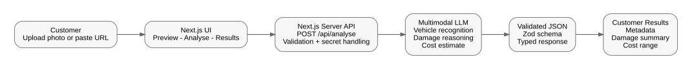
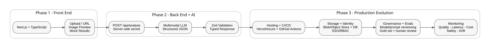

# AI Vehicle Claims Prototype — Product & Technical Specification

## 1. Objective

Build a lightweight, customer-ready AI prototype that allows a user to submit a photograph of a damaged vehicle and receive an AI-assisted vehicle damage assessment.

The prototype should demonstrate an end-to-end workflow that:

- accepts an uploaded vehicle image or image URL;
- identifies available vehicle metadata;
- describes visible vehicle damage;
- estimates a preliminary repair cost range;
- communicates uncertainty through confidence indicators, warnings and assumptions;
- identifies cases that may require human review.

The primary objective is to validate the customer experience and technical feasibility quickly rather than build a production claims-management platform.

---

## 2. User Journey

### Primary user

Insurance claims assessor / vehicle damage reviewer.

### User journey

1. User opens the web application.
2. User provides a vehicle image by:
   - uploading an image file; or
   - providing an image URL.
3. The application displays an image preview.
4. User selects **Analyse Damage**.
5. The application sends the image to the server-side analysis API.
6. The multimodal AI model analyses:
   - vehicle characteristics;
   - visible damage;
   - likely affected areas;
   - severity;
   - preliminary repair-cost range.
7. The server validates and structures the model response.
8. The application displays:
   - vehicle metadata;
   - damage assessment;
   - affected areas;
   - severity;
   - repair estimate;
   - confidence indicators;
   - assumptions;
   - warnings;
   - human-review requirement.
9. The assessor uses the information as decision support rather than as an autonomous claims decision.

---

## 3. MVP Scope

The MVP will include:

### Image input

- Upload vehicle image from local device.
- Provide publicly accessible image URL.
- Preview selected image before analysis.

### Vehicle identification

Return:

- make;
- model;
- colour;
- confidence.

### Damage assessment

Return:

- textual damage summary;
- severity;
- affected areas;
- confidence.

### Repair estimate

Return:

- minimum estimated cost;
- maximum estimated cost;
- currency;
- assumptions;
- confidence.

### Decision-support information

Return:

- `reviewRequired`;
- warnings.

### Application behaviour

- loading state while analysis runs;
- validation errors for invalid input;
- customer-friendly results display;
- server-side AI invocation;
- structured and schema-validated AI response.

---

## 4. Out of Scope

The MVP will deliberately not implement:

- claims history;
- persistent image storage;
- user authentication;
- claims-system integration;
- automatic claim approval or denial;
- repair-shop integration;
- vehicle-parts pricing catalogue;
- labour-rate databases;
- payment processing;
- production RBAC;
- enterprise audit logging;
- full observability platform;
- production-grade evaluation pipeline;
- model routing;
- multi-agent orchestration.

These capabilities are candidates for later production phases.

The prototype is intentionally stateless unless persistence becomes necessary during development.

---

## 5. Architecture

The MVP uses a single full-stack application to minimise integration overhead and accelerate delivery.

### High-level flow

User  
→ Next.js user interface  
→ server-side `/api/analyse` endpoint  
→ multimodal AI model  
→ structured response  
→ schema validation  
→ results UI

The browser does not call the AI service directly.

AI credentials remain server-side.

The MVP architecture is documented here:



The broader architecture evolution is documented here:



### Key architectural decisions

#### Single full-stack application

Next.js is used for both the user interface and server-side API.

This avoids creating and deploying separate front-end and back-end applications during the MVP.

#### No persistent storage

Images and analysis results do not need to be stored to validate the initial customer workflow.

This reduces implementation complexity and avoids unnecessary data-retention concerns.

#### Single multimodal model

The MVP uses a vision-capable multimodal model to perform vehicle recognition, damage interpretation and preliminary estimate reasoning in a single analysis flow.

A production system may decompose these responsibilities into specialised components or external pricing services.

#### Structured AI output

The model must return structured data rather than free-form prose.

The application validates the model output before displaying it to the user.

---

## 6. Data Model

The analysis response will contain three main sections:

- `vehicle`
- `damage`
- `repairEstimate`

It will also contain cross-cutting decision-support fields:

- `reviewRequired`
- `warnings`

### Proposed response

```json
{
  "vehicle": {
    "make": "BMW",
    "model": "3 Series",
    "color": "Black",
    "confidence": 0.84
  },
  "damage": {
    "summary": "Dent and abrasion to left rear bumper",
    "severity": "moderate",
    "affectedAreas": [
      "rear bumper",
      "left quarter panel"
    ],
    "confidence": 0.88
  },
  "repairEstimate": {
    "costRange": {
      "min": 900,
      "max": 1400,
      "currency": "GBP"
    },
    "assumptions": [
      "No structural damage visible",
      "Estimate based only on visible damage"
    ],
    "confidence": 0.58
  },
  "reviewRequired": true,
  "warnings": [
    "Final repair cost requires professional inspection"
  ]
}